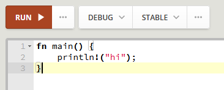
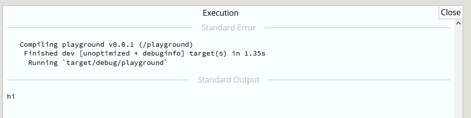
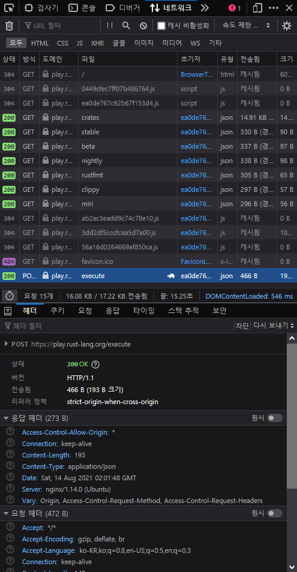
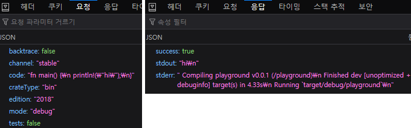

# Rust PlayGround

러스트 플레이그라운드에서 코드를 실행하고, 결과를 가져오는 방법

---

[플레이그라운드](https://play.rust-lang.org/) 에 접속후, 다음과같이 입력을 해봅니다.



그리고, `RUN ▶` 버튼을 눌러보면, 



처럼  결과물이 출력되는것을 볼 수 있습니다.

상당히 유용한 기능입니다.

하지만, 우리는 `api`를 원하며, 플레이그라운드에서는 별다는 **api 문서**를 제공하지않습니다.

---

**(파이어폭스 기준)**

`DevTool (Ctrl + Shift + I)` -> `네트워크` -> `새로 고침 (Ctrl + R)` -> `RUN ▶`을 누른다면, 다음과같은 결과가 나올것입니다.



많은것들이 있지만, 우리가 사용할것은 `execute` 부분입니다.

`https://play.rust-lang.org/execute` 에 `POST` 방식입니다.  



우리는 저 방식대로, 코드를 짜면됩니다.

간단하게 러스트 `reqwest` 크레이트를 사용하면, 아래의 코드처럼 될것입니다.

```rs
let code = r#"
fn main() {
    println!("Hello, World!");
}
"#;
let client = reqwest::Client::new();
let format = format!(
    "
    {}\"channel\":\"stable\",
    \"mode\":\"debug\",
    \"edition\":\"2018\",
    \"crateType\":\"bin\",
    \"tests\":false,
    \"code\":\"{}\",
    \"backtrace\":false{}",
    "{\n", code, "\n}"
);
let res = client
    .post("https://play.rust-lang.org/execute")
    .header("content-type", "application/json")
    .body(format.clone())
    .send()
    .await?;
let json = &json::parse(res.text().await?.as_str())?;
```

---
## 요청
`channel`: stable/beta/nightly

`mode`: debug/release

`edition`: 2015/2018/2021

`crateType`: bin/lib

`tests`: false/true

`code`: Rust Code

`backtrace`: false/true

---
## 응답

`success`: false/true

`stdout`: 코드의 결과물입니다.

`stderr`: 컴파일러가 코드를 실행하기전, 출력하는 부분입니다. (오류도 이곳에서 출력됨)

---